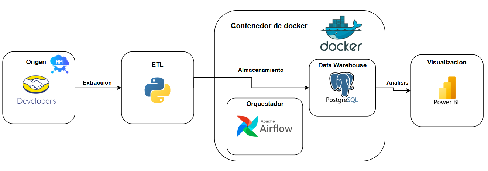

# 📊 ETL con Airflow para consumir datos desde una API
---

## 📋 Descripción del Proyecto
Este proyecto es una canalización de datos construida con **Apache Airflow** para recopilar información sobre productos de la categoría **"Alimentos y Bebidas"** de MercadoLibre, almacenarlos en una base de datos **PostgreSQL** y calcular descuentos de los productos más relevantes.

---

## 🔧 Arquitectura




---

## 🌟 Características principales
- 🔍 **Extracción de datos**: Uso de la API pública de MercadoLibre para acceder a información de productos.
- 🧹 **Transformación de datos**:
  - Limpieza de datos y normalización usando **Python** y **Pandas**.
  - Cálculo del **porcentaje de descuento** sobre el precio original.
- 🗄️ **Carga en base de datos**:
  - Inserción de datos procesados en **PostgreSQL**, optimizando su almacenamiento para búsquedas rápidas y evitando duplicados.
- 🔄 **Automatización diaria**:
  - Implementación del flujo ETL programado con **Apache Airflow** para ejecutar la canalización de forma automatizada.
- ✅ **Pruebas unitarias**:
  - Implementación de **pruebas unitarias** para detectar errores en el proceso ETL, especialmente en la manipulación de datos y la conexión a la base de datos.

---

## 🛠️ Tecnologías utilizadas

### Backend
- 🌐 **API REST**: Interacción con la API pública de MercadoLibre para extraer datos de productos.
- 🐍 **Python**:
  - Manejo de solicitudes HTTP con `requests`.
  - Procesamiento de datos con **Pandas**.
  - Escritura y limpieza de archivos CSV para manejar grandes volúmenes de datos.
  - **Pruebas unitarias** para validar el flujo de procesamiento de datos.
- 🐘 **PostgreSQL**:
  - Diseño de tablas para almacenamiento eficiente.
  - Uso de índices para mejorar el rendimiento en consultas.
  - Evitar duplicados con claves primarias y restricciones.

### Orquestación
- ⏱️ **Apache Airflow**:
  - Orquestación y gestión de tareas ETL.
  - Definición de flujos de trabajo modulares usando `PythonOperator` y `PostgresOperator`.

### Infraestructura
- 🐳 **Docker**:
  - Contenedorización del entorno de desarrollo para garantizar consistencia y portabilidad.
- **PostgresHook**:
  - Conexión eficiente entre Airflow y la base de datos PostgreSQL.

---

## 🚀 Flujo de trabajo ETL

### Extracción de datos
1. Consumo de la **API de MercadoLibre** para obtener productos de la categoría **"Alimentos y Bebidas"**.
2. Los datos se guardan en un archivo **CSV** como punto intermedio.

### Transformación de datos
- Limpieza de campos inconsistentes o faltantes.
- Cálculo del **porcentaje de descuento** para cada producto (si aplica).

### Carga de datos
1. Inserción de los datos en una tabla temporal (**staging**).
2. Transferencia a la tabla principal con eliminación de duplicados.

---

## 🧑‍💻 Ejecución del proyecto

1. Clona este repositorio:
   ```bash
   git clone https://github.com/tu_usuario/etl-mercadolibre-airflow.git
   cd etl-mercadolibre-airflow

2. Levanta el entorno de Docker:
```bash
docker-compose up -d
```

3. Ejecuta el DAG `create_tables` en **Airflow** para crear las tablas necesarias en **PostgreSQL**.


4. Ejecuta el DAG `etl_to_postgres` desde la interfaz de **Airflow** para iniciar la canalización.

---

### 📂 Estructura del proyecto
```plaintext
.
├── dags/
│   ├── data_pipeline.py       # Definición del flujo ETL
│   ├── create_tables.py       # Definición de tablas en PostgreSQL
├── docker-compose.yml         # Configuración para Docker
├── requirements.txt           # Dependencias del proyecto
├── README.md                  # Este archivo
```

---

### 🎯 Habilidades demostradas

#### 🔵 Desarrollo y automatización de canalizaciones de datos:
- Diseño y ejecución de flujos ETL automatizados con **Apache Airflow**.
- Optimización de procesos para manejar grandes volúmenes de datos.

#### 🟢 Análisis y limpieza de datos:
- Transformación y enriquecimiento de datos con **Python** y **Pandas**.
- Validación de datos faltantes e implementación de reglas de negocio.

#### 🟡 Gestión de bases de datos:
- Diseño de tablas relacionales para optimizar el almacenamiento y las consultas.
- Manejo de duplicados y mejora de índices para consultas eficientes.

#### ⚪ Orquestación y despliegue:
- Uso de **Docker** para la contenedorización del proyecto, facilitando la portabilidad.
- Configuración de conexiones seguras entre servicios.

#### 🔴 Interacción con APIs:
- Manejo avanzado de **APIs REST** para extracción de datos en tiempo real.

#### 🟣 Pruebas unitarias:
- Implementación de pruebas unitarias para validar la correcta ejecución de cada parte del flujo ETL, incluyendo el manejo de excepciones y validación de datos.
